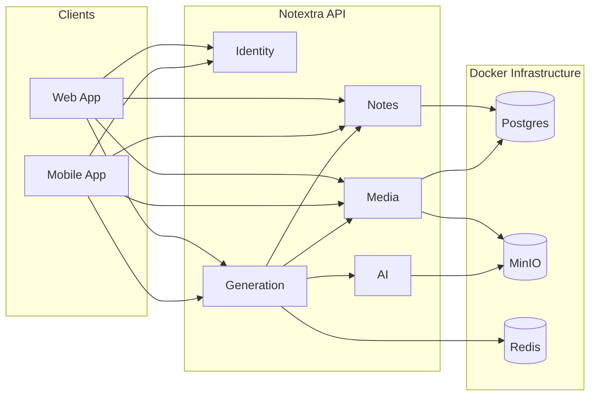

# Notextra — Architecture

## Design principles

1. **Modular monolith first** — One deployable unit with clear module boundaries. Extract to microservices only when a module has independent scaling needs.
2. **Event-driven inside, REST outside** — Modules publish domain events; clients talk to a unified REST API.
3. **Async AI workloads** — Transcription and generation are long-running; use job queue (Redis) with status polling or WebSocket updates.
4. **Media off DB** — Binary files live in object storage (MinIO/S3); Postgres stores metadata and references only.

## Module interaction



## Data model (high level)

```
User
 └── Note
      ├── NoteBlock (text, markdown)
      └── NoteAttachment → MediaAsset

MediaAsset
 ├── type: IMAGE | AUDIO | VIDEO | DOCUMENT
 ├── storageKey (MinIO path)
 └── metadata (duration, mime, size)

GenerationJob
 ├── sourceNoteIds[]
 ├── sourceMediaIds[]
 ├── outputType: NOTE | PRESENTATION | TRANSCRIPT | PDF
 ├── status: QUEUED | PROCESSING | COMPLETED | FAILED
 └── resultNoteId / resultMediaId
```

## API surface (planned)

| Method | Path | Module |
|--------|------|--------|
| POST | `/api/auth/register` | identity |
| POST | `/api/auth/login` | identity |
| GET/POST | `/api/notes` | notes |
| POST | `/api/media/upload` | media |
| POST | `/api/generation/jobs` | generation |
| GET | `/api/generation/jobs/{id}` | generation |

## Client strategy

| Platform | Stack | Rationale |
|----------|-------|-----------|
| Web | Next.js + TypeScript | SSR, API routes for BFF if needed |
| Mobile | Expo (React Native) | Shared TS types with web, fast iteration |

Both clients consume the same REST API. Consider generating an OpenAPI client from the backend spec for type-safe SDKs.

## Docker deployment

**Development:** `compose.yaml` runs Postgres, MinIO, Redis. API runs on host via Maven.

**Production:** Multi-stage Dockerfile builds the JAR; compose or Kubernetes runs API + infra containers. Secrets via environment variables or a secrets manager.

## AI provider abstraction

The `ai` module exposes a provider-agnostic interface:

- **Speech-to-text** — OpenAI Whisper, or local faster-whisper container
- **Text generation** — OpenAI, Anthropic, or local Ollama
- **Embeddings** — For semantic search across notes (future)

Swap providers without touching notes/media/generation modules.

## Security considerations

- JWT access + refresh tokens (identity module)
- Presigned URLs for direct media upload/download (no binary through API)
- User-scoped storage keys in MinIO
- Rate limiting on AI endpoints
- Input validation on generation prompts
